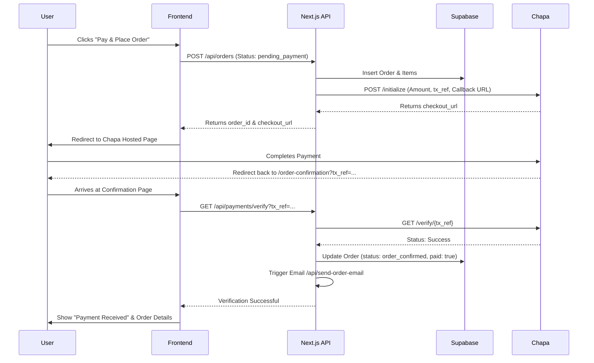

# PrintOnline.et v3.2 — Chapa Payment Integration Master Plan

> **Version:** 3.2.0  
> **Codename:** _Exchange_  
> **Date:** 2026-03-16  
> **Status:** DRAFT FOR APPROVAL  
> **Author:** Antigravity AI  
> **Company:** Pana Promotion  

---

## 1. Executive Summary

v3.2 (_Exchange_) focuses exclusively on integrating the **Chapa Payment Gateway** to enable secure online transactions. This phase transitions the platform from a "manual/cash-on-delivery" assumption to a professional e-commerce experience where orders are finalized upon payment.

### 1.1 Key Goals
- Implement **Hosted Checkout** for maximum reliability.
- Refactor the Checkout flow into a **3-step wizard** (Info → Review → Pay).
- Automate **Payment Verification** and order status updates.
- Ensure data integrity via server-side verification and webhook support.

---

## 2. Integrated Payment Flow (Hosted Redirect)

---

## 3. Task Breakdown

### Phase 1: Infrastructure & DB (P0)
- [ ] **Migration 011**: Execute [011_chapa_payment_updates.sql](file:///c:/Users/kidus/Documents/Projects/printonline-et/supabase/migrations/011_chapa_payment_updates.sql) to add `tx_ref`, `payment_provider`, and `payment_completed_at`.
- [ ] **Chapa Lib**: Create `lib/chapa.ts` utility for clean server-side API calls.
- [ ] **Type Updates**: Regenerate or manually update [types/database.ts](file:///c:/Users/kidus/Documents/Projects/printonline-et/types/database.ts) and [types/index.ts](file:///c:/Users/kidus/Documents/Projects/printonline-et/types/index.ts) to include new payment fields.

### Phase 2: Server-Side API Development (P1)
- [ ] **Initialize API**: Create/Modify `POST /api/orders`.
    - Generate `tx_ref` using `POL-TXN-{order_id}-{timestamp}`.
    - Synchronously call Chapa to get `checkout_url`.
- [ ] **Verify API**: Create `GET /api/payments/verify`.
    - Securely call Chapa's verify endpoint using the Secret Key.
    - idempotent check: If already marked as paid in DB, return success immediately.
- [ ] **Webhook API**: Create `POST /api/payments/webhook`.
    - Handle Chapa's asynchronous notifications for robustness.

### Phase 3: Checkout UI Refactor (P1)
- [ ] **The 3-Step Wizard**:
    - **Step 1**: Logistics & Delivery (Component: `OrderProfileSection`).
    - **Step 2**: Final Review & Terms (Component: [OrderReviewStep](file:///c:/Users/kidus/Documents/Projects/printonline-et/components/order/OrderReviewStep.tsx#20-156)).
    - **Step 3**: Payment Selection & Initiation (New Component: `OrderPaymentStep`).
- [ ] **Step Indicator**: Add a visual progress tracker to [OrderSummaryPage](file:///c:/Users/kidus/Documents/Projects/printonline-et/app/order-summary/page.tsx).

### Phase 4: Verification & Success UI (P2)
- [ ] **Verification State**: Update [OrderConfirmationPage](file:///c:/Users/kidus/Documents/Projects/printonline-et/app/order-confirmation/page.tsx).
    - Show a loading spinner while verification is in progress.
    - Handle "Payment Failed" or "Transaction Canceled" states gracefully.
- [ ] **Email Delay**: Update logic to send "Order Confirmed" email **only** after successful verification.

---

## 4. Technical Specifications

### 4.1 Chapa Initialize Parameters
| Parameter | Value |
|-----------|-------|
| `amount` | Order `total_amount` |
| `currency` | `ETB` |
| `email` | Customer Email |
| `first_name` | Customer Name (Split) |
| `tx_ref` | Generated unique reference |
| `return_url` | `process.env.NEXT_PUBLIC_APP_URL + "/order-confirmation"` |

### 4.2 Error Handling Matrix
| Scenario | Action |
|----------|--------|
| Chapa Init Fails | Alert user, keep order as `pending`, allow retry. |
| User Closes Tab on Chapa | Order remains `pending_payment` in DB. |
| Verification Fails | Show retry button or contact support message. |
| Duplicate Webhook | Idempotent check on `tx_ref` in DB prevents double update. |

---

## 5. Development & Testing Strategy

### 5.1 URLs
- **Dev**: `http://localhost:3000`
- **Prod**: `https://printonline.et`
- **Tunnel**: Use `ngrok http 3000` to receive Chapa Webhooks locally.

### 5.2 Test Credentials
- Use Chapa's test card numbers provided in their documentation for successful/failed simulations.

---

## 6. Implementation Checklist (Step-by-Step)

- [ ] Create `lib/chapa.ts`
- [ ] Create `app/api/payments/verify/route.ts`
- [ ] Create `app/api/payments/webhook/route.ts`
- [ ] Refactor [app/order-summary/page.tsx](file:///c:/Users/kidus/Documents/Projects/printonline-et/app/order-summary/page.tsx) for 3-step flow
- [ ] Update [app/api/orders/route.ts](file:///c:/Users/kidus/Documents/Projects/printonline-et/app/api/orders/route.ts) to include Chapa initialization
- [ ] Update [app/order-confirmation/page.tsx](file:///c:/Users/kidus/Documents/Projects/printonline-et/app/order-confirmation/page.tsx) with verification logic
- [ ] End-to-end testing with ngrok

---

## 7. File Reference Map

| File | Concern | Action |
|------|---------|--------|
| `lib/chapa.ts` | Integration Lib | **CREATE** |
| [app/api/orders/route.ts](file:///c:/Users/kidus/Documents/Projects/printonline-et/app/api/orders/route.ts) | Order Creation | **MODIFY** |
| [app/order-summary/page.tsx](file:///c:/Users/kidus/Documents/Projects/printonline-et/app/order-summary/page.tsx) | Checkout UI | **MODIFY** |
| [app/order-confirmation/page.tsx](file:///c:/Users/kidus/Documents/Projects/printonline-et/app/order-confirmation/page.tsx)| Verification UI | **MODIFY** |
| [types/database.ts](file:///c:/Users/kidus/Documents/Projects/printonline-et/types/database.ts) | Schema Types | **UPDATE** |
